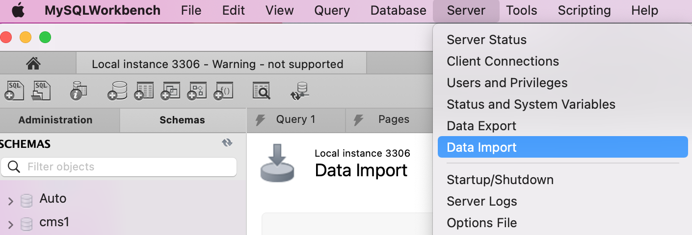
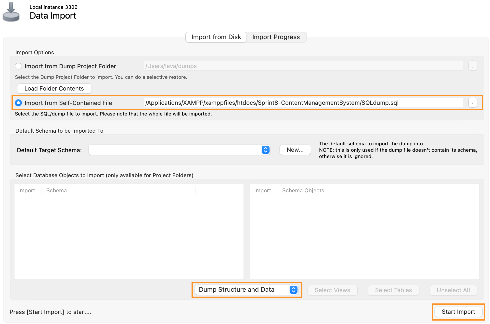

# Sprint 8 - Content Management System

## About

- Sprint 8 is a project i made while studying at BIT.
- It's an application created with PHP using OOP (object oriented programming) and MySQL Workbench as database.
- For the main styling i used Bootstrap framework and a bit of raw CSS.

## Features

- This Content Management System is connected with MySQL Workbench. All the changes made in the application change data in the database too, and the other way around.
- This application has login form. Once you are logged in as **ADMIN**, you can:
  - See all the articles and their publication date;
  - Create new articles using HTML;
  - Update articles;
  - Delete articles;
  - See the application through the user eyes (link to the Blog page).
- The **USER** is allowed only to see the content you created:
  - Navigate through articles (read more about the specific article);
  - Check articles archive (in the main page is displayed only 5 most resent articles, others are stored in the archive);

## Launch procedure

To run this project you will need XAMPP, MySQL Workbench and VScode.

1. To clone this project: navigate to the `XAMPP => htdocs` directory, here you have to save this project. Open your terminal and type `git clone https://github.com/IevaBa/Sprint8-ContentManagementSystem.git`.
2. Run XAMPP and start Apache and MySQL Servers.
3. Open MySQL Workbench select **Server => Data import**.

4. Choose:

- **Import from Self-Contained File** and select **SQLdump.sql** file from cloned repository;
- Make sure **Dump Structure and Data** is selected;
- Finally select **Start Import**.

5. Refresh MySQL Workbench and you should see created database CMS and table **articles** with data in it.
6. Open your browser and in searchbar type:

- `http://localhost/Sprint8-ContentManagementSystem/` to see the Blog as the **user**.
- `http://localhost/Sprint8-ContentManagementSystem/admin.php` to login as **admin**.
  - Login `username: admin`
  - Login `password: 1234`.

7. Enjoy!

## Author

This project was created by me - Ieva Baltriukaite.

Find me on [LinkedIn](https://www.linkedin.com/in/ieva-baltriukaite-59038755/)
